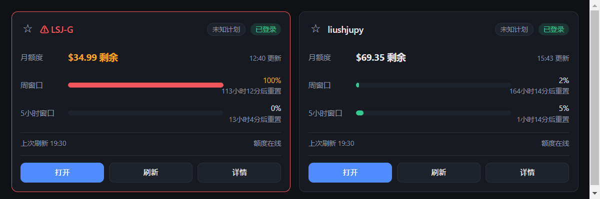
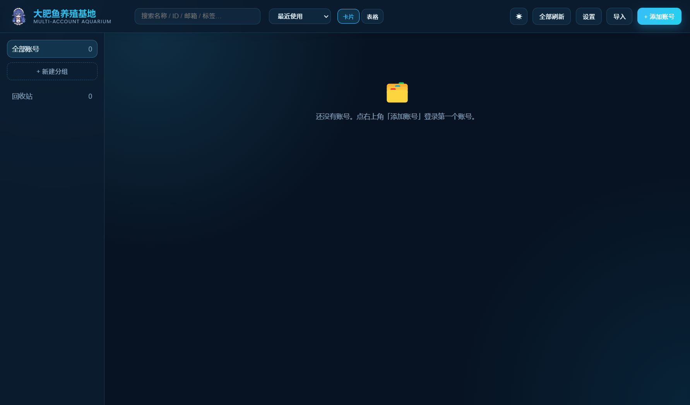

# 大肥鱼养殖基地

> 一个 Windows 桌面应用，统一管理多个 commandcode.ai / 智谱 BigModel / DeepSeek 账号：账号增删改查、三档额度看板（月 / 周 / 5 小时）、一键带会话打开账号页面、会话保活减少重复登录。
>
> An Electron desktop manager for multiple LLM-service accounts (CommandCode, Zhipu BigModel, DeepSeek) with quota dashboards and session keep-alive.



当前版本：**v0.2.3**

---

## 下载安装

到 [Releases](../../releases) 页面下载最新版安装包：

- `大肥鱼养殖基地 Setup <版本>.exe` — Windows 安装包（NSIS），双击安装，桌面生成快捷方式。
- `大肥鱼养殖基地-<版本>-portable.zip` — 免安装版，解压后直接运行目录里的 `大肥鱼养殖基地.exe`。

安装包未做代码签名，Windows SmartScreen 可能提示"未知发布者"，选「更多信息 → 仍要运行」即可。

**本软件不包含任何账号数据。** 所有账号与凭据只保存在本机 `%APPDATA%\大肥鱼养殖基地\` 下，不会上传到任何服务器。

## 功能

- **账号管理**：CommandCode / 智谱 BigModel / DeepSeek 三个平台隔离管理；编辑、软删除、分组、搜索、备注、收藏位。
- **两种视图**：卡片 / 表格可切换（表格适合账号多的时候）；支持手动拖拽排序，以及最近使用 / 余额 / 名称 / 创建时间排序；手动顺序会同步到卡片、表格和局域网页。
- **批量导入**：CSV / TSV / 记事本粘贴 / 选择文件，自动识别列（账号ID / 邮箱 / 名称 / 分组 / 备注 / API Key / 平台），按账号 ID 查重，可合并补全。
- **额度看板**：单账号刷新 / 全部刷新，展示月剩余、周窗口、5 小时窗口（已用 / 上限 / 百分比 / 重置倒计时）；详情页带用量趋势迷你图。
- **DeepSeek 余额**：只需官方 API Key，直接读 `GET /user/balance` 展示余额（CNY / USD、充值 / 赠金、可用状态），无需网页登录。今日消费与 Token 用量官方没有仅凭 Key 的接口，详情页提供跳转到 platform.deepseek.com/usage。
- **一键打开**：点「打开」用独立窗口加载该账号的 usage 页（每个账号独立会话隔离）；详情里可改用系统浏览器打开；支持按当前筛选结果「打开全部」。
- **浏览器一键添加**：账号已在浏览器登录时，点一个书签小工具就能把会话带进软件，不用再登录一次。
- **会话保活**：启动自动巡检 + 每轮保活自愈；失效会标红"需要重新登录"，到期前提醒一键重登。
- **托盘常驻**：关闭窗口最小化到托盘，后台继续保活 / 刷新；托盘菜单含「打开主界面 / 全部刷新 / 退出」。
- **提醒与自启**：额度预警、订阅续费提醒（周期结束前 N 天）、开机自启开关。
- **登录凭据**：记录登录方式（邮箱密码 / GitHub OAuth）、登录账号与账号密码；密码本机加密保存，界面默认隐藏，可按需显示或复制。
- **智谱 BigModel**：内嵌登录后自动捕获官方登录令牌，读取 5 小时 / 周 / MCP 月三档余量；令牌与 API Key 本机加密，可显示复制并一键续登。
- **局域网用量页**：可选开启只读用量页，密码登录，默认密码 `0258`，可在客户端修改。



## 数据安全

- 数据文件在 `%APPDATA%\大肥鱼养殖基地\data.json`，自动备份到 `backups/`（保留近 14 份）；旧版本数据会自动迁移。
- 敏感字段（会话 Cookie、API Key、账号密码、智谱令牌）经 Electron `safeStorage`（Windows DPAPI / CNG）加密后以 base64 落盘。
- 渲染进程拿不到明文 Cookie，主进程解密后只用于 API 调用与注入。
- 公开的账号列表只返回"是否有凭据"，不返回任何密文。
- 「导出凭据 CSV」会导出明文密码和第一个 API Key，仅供本机备份，导出后请自行妥善保管；普通清单 CSV 不含敏感信息。

## 运行（源码方式，无需安装包）

```bat
启动软件.bat
```

脚本会在首次运行时自动 `npm install` 并构建界面。也可以手动：

```bash
npm install
npm run build:renderer   # 构建前端
npm run start            # 启动应用
```

开发模式（热更新 + DevTools）：

```bash
# PowerShell
$env:VITE_DEV_SERVER_URL = "http://localhost:5173"
npm run dev      # 终端 1：vite dev server
npm run start    # 终端 2：electron 加载 dev server
```

### 自检

```bash
npm run smoke      # 无头验证主进程 + 渲染进程 + React 挂载，期望输出 [smoke] SMOKE_OK
npm run selftest   # 主进程模块 + 导入解析 + 会话修复逻辑
npm run e2e        # 驱动真实 UI：分组创建 / 详情账号ID / 登录窗口跳转 / 表格视图 / 书签一键添加
npm run livecheck  # 用应用本体验证线上会话（解密本地会话并调 get-session，只读）
```

## 打包

```bash
npm run tray:icons   # 立绘改了才需要重跑，产物在 build/tray/
npm run dist         # = check:pack + build:renderer + electron-builder --win nsis
# 产物：release\大肥鱼养殖基地 Setup <版本>.exe
```

- `build.nsis.guid` 固定为 `7a3d4421-51dd-5e2f-b2bc-adbcd16c7299`，保证新版本是**覆盖升级**而不是并存安装（装到 `%LOCALAPPDATA%\Programs\bigfish-account-farm`）。
- `npm run check:pack` 会在打包前检查项目根目录是否有文件名损坏的条目（本目录历史上被 Windows 输入法写坏过 `user.config` 之类），损坏时 electron-builder 会报一句没头没尾的 `lstat ENOENT`，这里提前说清楚。

### Electron 镜像（国内网络）

`node_modules/electron` 二进制默认从 GitHub 下载，不稳定时项目根 `.npmrc` 已配置：

```
electron_mirror=https://npmmirror.com/mirrors/electron/
electron_builder_binaries_mirror=https://npmmirror.com/mirrors/electron-builder-binaries/
```

也可以设置环境变量 `ELECTRON_MIRROR` 后重新 `npm install`。不需要镜像时删掉这两行即可。

## 使用说明

### 浏览器一键添加（书签小工具）

适合"账号已经在浏览器里登录"的场景，跳过登录窗口直接带入会话：

1. 启动本软件（首次会注册 `ccam://` 协议，之后每次启动自动保持注册）。
2. 点「+ 添加账号」→「浏览器一键添加」，复制书签代码。
3. 在 Chrome / Edge 新建书签，把代码整段粘贴到「网址」栏保存（书签名随意，如"CC加号"）。
4. 在已登录的 commandcode.ai 页面点这个书签 → 软件弹出确认框 → 点「保存账号」即完成。

书签会把当前页面的登录会话（Cookie）经本机协议跳转发给本软件，仅本机传递；应用只把加密后的 Cookie 落盘，不写明文日志，也不会把 Cookie 发给任何第三方。

### 批量导入表头

通用列：`账号ID, 邮箱, 名称, 分组, 备注, 平台, API Key`

登录凭据列：`登录方式, 登录账号, 密码`

智谱 BigModel 专用列：`智谱登录令牌, 智谱API Key`；`平台` 填 `bigmodel` 或 `智谱`。

DeepSeek：`平台` 填 `deepseek` / `ds`，只需 `API Key` 列即可。

### 局域网用量页

- 设置 →「局域网用量查看」开启；默认地址 `http://<本机局域网IP>:8765`，默认密码 `0258`。
- 端口、开关和密码都能在客户端修改；页面只展示用量和登录状态，不提供账号凭据与编辑功能。
- 网页密码用随机盐 + scrypt 存储；连续 10 次错误密码会临时限制来源 IP。
- 首次开启时 Windows 防火墙若弹授权，请**只允许"专用网络"**，不要放行到公用网络。

## 目录结构

```
src/main/       Electron 主进程（存储 / 账号 / 会话 / 额度采集 / 保活 / 浏览器 / IPC）
src/renderer/   React 渲染进程（UI）
build/          图标素材（应用图标、托盘图标）
scripts/        自检、E2E、图标生成、打包前检查
docs/images/    README 用的界面截图
release/        打包产物（不进版本库）
```

## 实现备注

### 额度数据来源

- 通道 1（首选）：会话 Cookie → `api.commandcode.ai/internal/*`（网页同款）
- 通道 2（备用）：API Key → `api.commandcode.ai/alpha/*`（CLI 同款）
- 会话约 8 天有效（`session.expiresAt`）。`session_data` 的 5 分钟窗口只是网页端缓存，与 API 鉴权无关。
- 远程续期不可用（`update-session` 返回 400、`POST get-session` 返回 405），所以巡检策略是：定期 `GET /auth/get-session` 健康检查 + 到期前提醒一键重登。
- Cookie 值若被 URL 转义（`%2B` / `%3D`）会导致 401，捕获 / 注入时会自动还原。
- 智谱用量来自 `https://www.bigmodel.cn/api/monitor/usage/quota/limit`；令牌失效会明确标记，不会混进 CommandCode 的额度结构。
- `user_...` 开头的智谱 API Key 不能调用网页用量接口（返回 `code=1001`），只作为凭据记录备用。

### 账号 ID 与会话修复

- usage 链接用的是**登录名**（commandcode.ai 上的数字 ID），不是头像资料里的用户 UUID。
- 早期版本误把 UUID 存成账号 ID，点「系统浏览器打开」会跳 404。v0.1.1 起：新增账号一律用登录名；启动时自动巡检并修复存量错误 ID（需要可解密的会话）；修不了的标记为"需要重新登录"，详情里一键重登后自动修复，不会重复建号。
- 本地加密密钥轮换（重装系统 / 系统还原）会导致已存 Cookie 解不开，软件会明确标红"需要重新登录"，不会把坏会话当健康会话继续保活。
- 重新登录会按用户 UUID / 邮箱 / 登录名自动归属到原账号，不会创建重复账号。

### 浏览器一键添加的 Cookie 名

官网实际使用 `__Secure-commandcode_prod_.session_token` 和 `__Secure-commandcode_prod_.session_data`。启动时会自动迁移旧书签保存的错名 Cookie；读取、注入、保活和额度刷新前都会再次规范化。手动粘贴 Cookie 也接受旧错名并自动转换。

## 许可

代码以 [GNU AGPL-3.0](LICENSE) 发布。你可以在 AGPL 条款下自由使用、修改、分发；如果你把修改后的版本作为网络服务提供给别人使用，也必须公开你的源代码。

> 注意：仓库内 `build/` 与 `src/renderer/assets/` 下的角色美术素材（应用图标、托盘图标、界面立绘）版权归属与代码不同，**不在 AGPL 授权范围内**，请勿单独提取使用。详见 [NOTICE.md](NOTICE.md)。二次分发本软件时请保留原素材或替换为你自己的素材。

## 贡献

Issue 和 PR 都欢迎。改代码前建议先跑一遍 `npm run selftest && npm run smoke`，确保基线是通过的。
